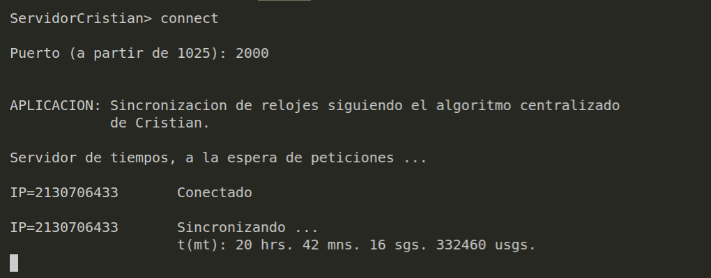
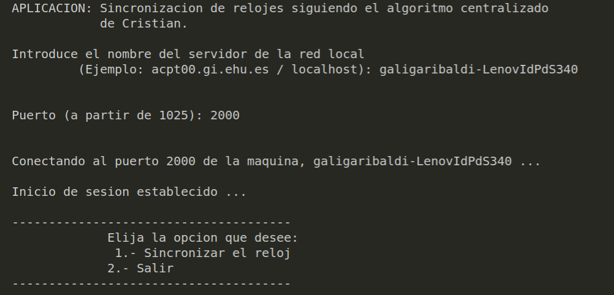

# Proyectos Sistemas Distribuidos

En este repositorio se subirán los proyectos correspondientes a la materia de Sistemas Distribuidos 

### Proyecto 1

El siguiente proyecto consta de varias partes y puede implementado a través de máquinas virtuales

* **Parte 1:** Realice la isntalación del manejador de bases de datos *MariaDB* en un entorno linux y cree una base de datos que se encargará del almacenamiento de los datos de las cuentas de un banco. El diseño de dicha base se deja a consideración del alumno
* **Parte 2:** Realice una API REST que permita la manipulación de la base de datos. El lenguaje para implementar dicha API se deja a consideración del alumno
* **Parte 3:** Cree una aplicación que simula un cajera en el cual solo se puede realizar la lectura de los datos de los cuentahabientes del banco. Se debe poder conectar mas de un cliente a la vez. Dos clientes diferetnes pueden consultar información de la misma cuenta, por tanto debe existir un registro de la última cvisita de los datos.

### Proyecto 2

Tomando como base los programas generados en la tarea #5 (Sockets) realice lo siguiente:

1. **Implemente el metodo de Cristian para la sincronización de relojes Ficticios implementando un buffer de mensajes en el servidor**

   ##### Server

   - Para este proyecto es necesario abrir 2 terminales, en el primero se compilará y ejecutará el archivo *server.c* esto se hace de la siguiente forma `gcc server.c -o server` y se ejecutará con el siguiente comando `./server`

   - Nos pedirá un puerto, a través del cual estará ajustando los relojes y posteriormente nos arrojará los ajustes del reloj

     

   ##### Cliente

   - Para ejecutar el cliente tenemos que compilar usando los siguientes comandos `gcc client.c -o client` y se ejecutará con el siguiente comando `./client`
   - Nos pedirá el hostname de nuestra computadora, esto se puede saber usando el siguiente comando `hostname`, de esta forma obtenemos el hostname y lo pegamos donde nos indica
   - Después nos pedirá de nuevo un puerto, pondremos el mismo puerto que pusimos en el servidor, en este caso 2000
   - Empezará a ejecutarse el código

   

2. **Implemente el algoritmo de Berkley para la sincronización de relojes ficticios implementando la comunicación multicast con hilos**

   - Se deben instalar unas librerias en ubuntu 19.04, estos viene expllicados en el siguiente enlace

   - `mpicc -showme`este comando nos servirá para saber que extensión usar en este programa
   - ``mpicc -g -I/usr/lib/x86_64-linux-gnu/openmpi/include -o main main.c -lm` finalmente usaremos esta linea para corre nuestro programa.

Para este proyecto, no es necesario el uso de mas máquinas virtuales o máquinas físicas, ya que ambos códigos, corren en una sola computadora o en diferentes terminales.

Este proyecto se encuentra en lenguaje C

### Integrantes del Equipo

* Cabrera Garibaldi Hernán Galileo
* Gutiérrez Castillo Óscar
* Medel Sánchez Berenice
* Espinoza Jiménez Francisco Javier